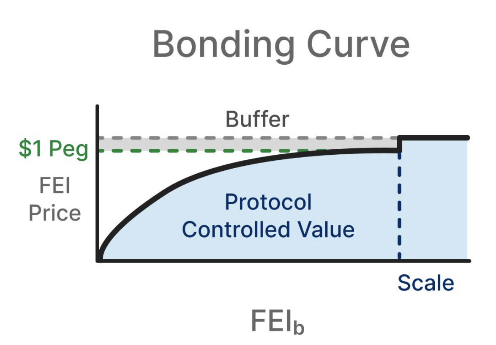

# Bonding Curves

## Bonding Curves

Bonding curves are price functions for a token that usually take in the current circulating supply as a parameter in the formula. They are generally monotonically increasing, facilitating greater incentives for early adopters.

When coupled with a smart contract, bonding curves can escrow, buy and sell tokens in accordance with the price function. The contract can take fees for buying and selling as a fundraising mechanism for [Protocol Controlled Value](../protocol-controlled-value/). 

Article by Linum Labs with more details:



## Fei Protocol Bonding Curves

Fei Protocol's primary issuance mechanism for FEI are bonding curves. These bonding curves can have any parameterization but should follow this pattern:

* Use a curve with a desirable growth rate
* Have a "shift" that determines the starting price
* Have a "Scale" target at which the curve switches to fixed relative to the oracle peg
* Have a "buffer" which is a percentage premium above the peg that the curve trades at post-Scale


The Fei Core Team feels strongly that Fei Protocol should only issue bonding curves denominated in decentralized tokens


Fei Protocol bonding curves have unique features. They are buy-only, meaning that purchasers must go elsewhere to sell their FEI. The Fei Protocol prioritizes PCV liquidity with the assets it receives from the curve. Additionally, the price function of a bonding curve is not based on the total circulating supply of FEI but only based on the amount of FEI purchased on that specific bonding curve.

Fei Protocol is launching with a single, ETH denominated bonding curve with plans for more as the protocol scales.

