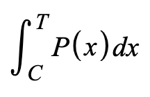

# BondingCurve

## Contract

[BondingCurve.sol](https://github.com/fei-protocol/fei-protocol-core/blob/master/contracts/bondingcurve/BondingCurve.sol) implements [IBondingCurve](https://github.com/fei-protocol/fei-protocol-core/blob/master/contracts/bondingcurve/IBondingCurve.sol), [OracleRef](https://github.com/fei-protocol/fei-protocol-core/blob/master/contracts/refs/OracleRef.sol), [PCVSplitter](https://github.com/fei-protocol/fei-protocol-core/blob/master/contracts/pcv/PCVSplitter.sol)

## Description

An abstract bonding curve for purchasing FEI and routing of the purchased asset to PCV.

The amount of PCV it takes in a purchase transaction to bring the curve to a total amount of FEI issued _T_ is determined by integrating the price function between the current FEI amount issued _C_ by the bonding curve and the target amount _T_ after the transaction. 



The quantity _T-C_ is the amount of FEI received by the transaction. Since _C_ is a known constant, we solve for _T_ by setting the formula equal to a PCV purchase quantity _Q_ and rearranging terms.

Post scale, the price should be $1 + _b_  times the peg, where _b_ is the variance buffer and the peg is reported as X per FEI. In the implementation, we use $1 - _b_ because the peg is inverted so the price relationship is also inverted.

### Allocation

Incoming PCV is held temporarily to allow for batch transactions via the `allocate()` function. The PCV allocation gets split into a weighted list of PCV deposit contracts, \(see [PCVSplitter](https://github.com/fei-protocol/fei-protocol-core/blob/master/contracts/pcv/PCVSplitter.sol)\). While allocations can be called at any time, there is a 500 FEI incentive for calling it after each 24 hour window. To determine eligibility for the incentive, simply call `isTimeEnded()` on the contract. The time until the next incentive is available is `remainingTime()`.



## [Access Control](../access-control/) 

* Minter💰

## Events



Purchase of FEI on bonding curve

| type | param | description |
| :--- | :--- | :--- |
| address indexed | \_to | recipient of FEI |
| uint256 | \_amountIn | amount of purchase asset |
| uint256 | \_amountOut | amount of FEI |



Allocate held PCV

| type | param | description |
| :--- | :--- | :--- |
| address indexed | \_caller | the sender of the allocation transaction |
| uint256 | \_amount | the amount of PCV allocated |



Governance change of Scale target

| type | param | description |
| :--- | :--- | :--- |
| uint256 | \_scale | new Scale target |



Governance change of Buffer

| type | param | description |
| :--- | :--- | :--- |
| uint256 | \_buffer | new buffer |



## Read-Only Functions

### getCurrentPrice

```javascript
function getCurrentPrice() external view returns (Decimal.D256 memory);
```

Returns current instantaneous bonding curve price. The price reported as FEI per X, with X being the underlying asset. This is analogous to the peg reported by the oracle.



We understand that this price is of a different character from the one returned by `getAveragePrice(uint256 amountIn)`. We hope it doesn't cause too much confusion.


Can be inaccurate if outdated, need to call `oracle().isOutdated()` to check


### getAveragePrice

```javascript
function getAveragePrice(uint256 amountIn)
    external
    view
    returns (Decimal.D256 memory);
```

Return the average price of a transaction of size `amountIn` ETH along bonding curve. The price here is reported as USD per FEI.

We understand that this price is of a different character from the one returned by `getCurrentPrice()`. We hope it doesn't cause too much confusion.


Can be inaccurate if outdated, need to call `oracle().isOutdated()` to check


### getAmountOut

```javascript
function getAmountOut(uint256 amountIn)
    external
    view
    returns (uint256 amountOut);
```

Returns the amount `amountOut`of FEI received for a purchase of `amountIn` ETH.


Can be inaccurate if outdated, need to call `oracle().isOutdated()` to check


### scale

```javascript
function scale() external view returns (uint256);
```

The target `totalPurchased` after which the bonding curve price switches to a fixed premium on the peg.

### atScale

```javascript
function atScale() external view returns (bool);
```

Returns true when `totalPurchased()` is greater than `scale()`

### buffer

```javascript
function buffer() external view returns (uint256);
```

The multiplier applied to the peg price when post-Scale.

### BUFFER\_GRANULARITY

```javascript
function BUFFER_GRANULARITY() external view returns (uint256);
```

The granularity of the buffer. Constant at 10,000.

### totalPurchased

```javascript
function totalPurchased() external view returns (uint256);
```

Returns the cumulative amount of FEI issued via the bonding curve. Used in the bonding curve formula as the supply amount.

### getTotalPCVHeld

```javascript
function getTotalPCVHeld() external view returns (uint256);
```

Returns the amount of PCV held in the contract and ready for allocation.

### incentiveAmount

```javascript
function incentiveAmount() external view returns (uint256);
```

Returns the amount of FEI sent to the keeper who calls `allocate()` while the incentive is active.

## State-Changing Functions <a id="state-changing-functions"></a>

### Public

#### purchase

```javascript
function purchase(address to, uint256 amountIn)
    external
    payable
    returns (uint256 amountOut);
```

Purchase `amountOut` FEI along the bonding curve for `amountIn` ETH and send the FEI to address `to`.

emits `Purchase`

#### allocate

```javascript
function allocate() external;
```

Allocate the PCV held by the bonding curve to the weighted PCV allocations returned by `getAllocation()`.

emits `Allocate`

### Governor**- Or Guardian**-Only**⚖️🛡**

#### **setBuffer**

```javascript
function setBuffer(uint256 _buffer) external;
```

Sets the buffer to `_buffer`. Must be less than `BUFFER_GRANULARITY`

emits `BufferUpdate`

### Governor-Only**⚖️**

#### **setScale**

```javascript
function setScale(uint256 _scale) external;
```

Sets the Scale target to `_scale`

emits `ScaleUpdate`

#### **setAllocation**

```javascript
function setAllocation(
    address[] calldata pcvDeposits,
    uint256[] calldata ratios
) external;
```

Sets the PCV allocation to `pcvDeposits` with weights `ratios`. The ratios must sum to `ALLOCATION_GRANULARITY` which is constant at 10,000.

