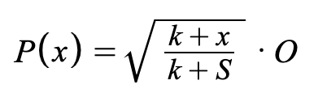
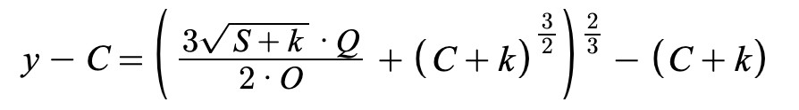

# EthBondingCurve

## Contract

[EthBondingCurve.sol](https://github.com/fei-protocol/fei-protocol-core/blob/master/contracts/bondingcurve/EthBondingCurve.sol) implements [BondingCurve](https://github.com/fei-protocol/fei-protocol-core/blob/master/contracts/bondingcurve/BondingCurve.sol)

## Description

A bonding curve implementation for purchasing FEI with ETH.

The price function used is:

* _x_ - the current amount of FEI issued from the bonding curve
* _S_ - the Scale target
* _O_ - the oracle price reported as underlying per FEI

The "k" shift is an additional feature since the white paper release. It shifts the starting price upward so the protocol can retain more [PCV](../protocol-controlled-value/). k is initially set to `S/3` which makes the starting price $0.50 per FEI.

The amount of FEI out for a given quantity of ETH input _Q_ is equal to the following:

y is the cumulative amount of FEI sold by the bonding curve after the trade and C is the current cumulative, so their difference is the amount sent to the user.

The Scale target is 100,000,000 FEI.

The oracle used is the [UniswapOracle](https://github.com/fei-protocol/fei-protocol-core/wiki/UniswapOracle).

## [Access Control](../access-control/) 

* Minter💰

