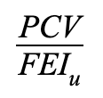

# Fei Stablecoin

## Design

FEI \(Fei USD\) is designed to allow for flexible upgrades and arbitrary incentive mechanisms to support the $1 peg target. 

Its issuance is controlled by the Minter💰role, and any contract with this role can mint FEI to any address. The Burner🔥 role can burn FEI from any address, and is useful for deflation and disincentives. 

## Direct Incentives

Fei Protocol uses the Direct Incentive approach to peg stability. This means that user actions can lead to a mint or burn of FEI from their wallet. The magnitude and direction of the incentive is based on the action taken and the market conditions at the time. 

The Direct Incentives are applied only when interacting with an _incentivized address_. When FEI is transferred to or from an __incentivized address, the corresponding _incentive contract_ is called, which is either a Minter💰, a Burner🔥, or both. The only incentivized address at launch is the ETH/FEI Uniswap v2 Pair and its incentive contract is [UniswapIncentive](uniswapincentive.md).

The Governor⚖️ can set and unset incentive contracts for any address. It can also exempt addresses from incentives.

## Collateralization

The FEI stablecoin is collateralized by a [PCV](../protocol-controlled-value/) reserve. Fei Protocol prioritizes liquidity when deploying this reserve to make sure users are able to trade FEI at high volume. 

Critically, FEI can be over- or under-collateralized depending on volatility on the PCV and other market conditions.

The collateralization ratio of FEI at any time is calculated as follows, with the denominator being "User controlled FEI":

The formula ignores "Protocol controlled FEI" because any FEI that the protocol holds will never be sold for PCV, only burned. Protocol controlled FEI can have second-order, short-term inflationary effects. For instance, FEI deposited into a lending market by Fei Protocol could increase the circulating supply when borrowed. The interest accrued and eventual withdrawal of that FEI ultimately have a net deflationary effect in the long term.

## Sell Allowlist

Fei Protocol v1 uses an "exclusive" fee on transfer when applying Direct Incentives on Uniswap sells. This means that the burn comes from the seller's balance. There are certain issues with this approach, the main one being that if a seller can transfer tokens directly from a pool such as a staking or liquidity pool, the pool can subsidize the seller's burn. 

This issue and the desire for precaution around the primary pool have led to the design decision to block all FEI transfers into the Uniswap FEI/ETH pair unless the sender is approved by the Fei DAO. The initial contracts approved at launch are the PCV Deposit and Controllers, and the FeiRouter.


LPing the FEI/ETH Uniswap pool is not allowed, because liquidity provision requires a FEI transfer into the FEI/ETH pool. 






