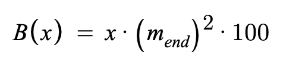
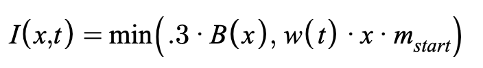
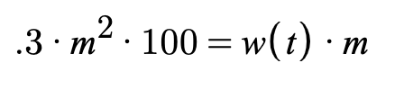

# UniswapIncentive

## Contract

[UniswapIncentive.sol](https://github.com/fei-protocol/fei-protocol-core/blob/master/contracts/token/UniswapIncentive.sol) implements [IUniswapIncentive](https://github.com/fei-protocol/fei-protocol-core/blob/master/contracts/token/IUniswapIncentive.sol), [UniRef](https://github.com/fei-protocol/fei-protocol-core/blob/master/contracts/refs/UniRef.sol)

## Description

The FEI incentive contract applied on transfers involving a Uniswap pair.

The UniswapIncentive contract assumes that all transfers involving Uniswap are either a sell or a buy. In either case, the hypothetical start and end price are calculated then compared to the peg to capture the magnitude distance _m_. See UniRef for more details on how these formulas are derived.



These parameters are fed into the incentive function to produce a mint \(in the case of buy\) or burn \(in the case of sell\) action. Any address can be exempted from incentives by governance.

### Sell \(Burn\)

All transfers going TO the uniswap pool are treated as a sell. This has the counterintuitive effect of treating liquidity provision as a sell.

The final magnitude _m_ deviation from the peg at the end of the hypothetical trade is used to calculate the burn amount. The burn formula for sell amount _x_ is: 



The burn is only applied to trades below the peg when incentive contract is appointed as a Burner🔥.

#### Exclusive vs Inclusive Fees

An exclusive fee is implemented as an additional transfer beyond the expected transfer. i.e. when a sender transfers 100 FEI with a 1% exclusive fee, the recepient receives 100 FEI, and the sender is charged 1 FEI from their remaining balance.

An inclusive fee is implemented "in-flight" as a part of the transfer. i.e. when a sender transfers 100 FEI with a 1% inclusive fee, the recepient receives 99 FEI, since the recepient is charged 1 FEI from the transfered amount.

Fei Protocol uses an exclusive fee for the Direct Incentives. They have the advantage of not affecting the expected ERC-20 transfer behavior of equal debits and credits, which can lead to easier integrations. A noteworthy drawback is that if the sender is a pooled contract, then the pool could be forced to pay the burn on behalf of the sender. For this reason only approved addresses can sell directly on the FEI/ETH incentivized Uniswap pair.


Only approved addresses can send FEI to Uniswap, blocking selling and liquidity provision.


The [FeiRouter](../trading/feirouter.md) is approved for selling and is the only way for end-users to sell FEI at launch.

Fei Protocol can use either inclusive or exclusive burn fees in the future, and even upgrade the existing exclusive fees to an inclusive type if needed.

### Buy \(Mint\)

All transfer going FROM the uniswap pool are treated as a buy. This has the counterintuitive effect of treating liquidity withdrawal events as buys.

The initial magnitude _m_ deviation from the peg before the hypothetical trade is used to maximize the potential mint amount. _w_ is the time weight we discuss in the next section. The mint formula for buy amount _x_ is: 



Current implementation caps the mint function at 30% of the output of the burn function. This ensures that burns are always greater or equal for a given magnitude _m,_ regardless of the path taken to the current distance from the peg.

Since incentives are applied flatly over the entire trade size _x_, a series of smaller sells could end up with a lower burn than a single large sell. The amount paid in the best case is rarely below 30% of the worst case, hence we cap the reward at 30% of the worst-case burn to make sure the mint doesn't exceed some best-case burn and lead to a flash profit opportunity.

The mint should only apply if the trade starts below the peg, and if the incentive contract is appointed as a Minter.

### Time Weight

The time weight is a scaling factor to make the incentive structured more like an auction. The trader willing to accept the lowest mint will come in and buy first before the reward gets higher.

The time weight grows linearly at a rate set by governance. Its granularity is 100,000 per block. I.e. a growth rate of 1000 would increment the weight by one unit every 100 blocks. It should only grow while "active" and will only be active when the last trade ended below the peg.

Trades should update the time weight as follows:

* If ending above peg, set to 0 and deactivate
* If ending below the peg but starting above, set to 0 and activate
* If starting and ending below peg, update pro-rata with a buy based on percent towards peg. For example, if trade starts at 10% deviation and ends at 1%, time weight should be scaled by 1%/10% =.10.
* If starting and ending below the peg, cap the time weight at the max incentive for the ending distance

### Incentive Parity

Incentive parity is defined as a boolean which is true when the mint incentive equals its max, i.e. the adjusted burn incentive. 



Parity is used as a trigger condition for reweights in the [UniswapPCVController](https://github.com/fei-protocol/fei-protocol-core/wiki/UniswapPCVController)

## [Access Control](../access-control/) 

* Minter💰
* Burner🔥

## Events



Time Weight change

| type | param | description |
| :--- | :--- | :--- |
| uint256 | \_weight | new time weight |
| uint256 | \_active | whether time weight is growing or not |



Governance change of time weight growth weight

| type | param | description |
| :--- | :--- | :--- |
| uint256 | \_growthRate | new growth rate |



Governance change of an exempt address 

| type | param | description |
| :--- | :--- | :--- |
| address indexed | \_account | the address to update |
| bool | \_isExempt | whether the account is exempt or not |



Governance change of a sell allowlisted address 

| type | param | description |
| :--- | :--- | :--- |
| address indexed | \_account | the address to update |
| bool | \_isSellAllowed | whether the account is allowlisted or not |



## Read-Only Functions

### isIncentiveParity

```javascript
function isIncentiveParity() external view returns (bool);
```

returns true if the conditions for incentive parity \(see above\) are met, otherwise false.

### isExemptAddress

```javascript
function isExemptAddress(address account) external view returns (bool);
```

returns true if `account` is exempted form incentives, otherwise false

### isSellAllowlisted

```javascript
function isSellAllowlisted(address account) external view returns (bool);
```

returns true if `account` is approved for selling, otherwise false

### TIME\_WEIGHT\_GRANULARITY

```javascript
function TIME_WEIGHT_GRANULARITY() external view returns (uint32);
```

returns the granularity of the time weight variable, set as a constant to `100,000`

### getGrowthRate

```javascript
function getGrowthRate() external view returns (uint32);
```

returns the current time weight growth rate, per block

### getTimeWeight

```javascript
function getTimeWeight() external view returns (uint32);
```

returns the current time weight

### isTimeWeightActive

```javascript
function isTimeWeightActive() external view returns (bool);
```

returns true if the time weight is active and growing

### getBuyIncentive

```javascript
function getBuyIncentive(uint256 amount)
    external
    view
    returns (
        uint256 incentive,
        uint32 weight,
        Decimal.D256 memory initialDeviation,
        Decimal.D256 memory finalDeviation
    );
```

returns the buy incentive amount `incentive`for a FEI transfer of `amount`out of the FEI/ETH incentivized Uniswap pool. Also returns the updated time weight `weight` and the `initialDeviation` and `finalDeviation` which are equal to _m_ start and end, respectively.

### getSellPenalty

```javascript
function getSellPenalty(uint256 amount)
    external
    view
    returns (
        uint256 penalty,
        Decimal.D256 memory initialDeviation,
        Decimal.D256 memory finalDeviation
    );
```

returns the sell penalty amount `penalty` a FEI transfer of `amount` into the FEI/ETH incentivized Uniswap pool. Also returns the `initialDeviation` and `finalDeviation` which are equal to _m_ start and end, respectively.

## State-Changing Functions <a id="state-changing-functions"></a>

### Governor-Only⚖️

#### setExemptAddress

```javascript
function setExemptAddress(address account, bool isExempt) external;
```

set `account` incentive exempt status to `isExempt`

emits `ExemptAddressUpdate`

#### setTimeWeight

```javascript
function setTimeWeight(
    uint32 weight,
    uint32 growth,
    bool active
) external;
```

set the current time weight to `weight`, growing at rate `growth` and active flag to `active` starting from the current block.

emits `TimeWeightUpdate` and `GrowthRateUpdate` if the growth rate changes

### Governor- Or Guardian-Only⚖️🛡

#### setSellAllowlisted

```javascript
function setSellAllowlisted(address account, bool isAllowed) external;
```

set `account` sell allowed status to `isAllowed`

emits `SellAllowedAddressUpdate`

#### setTimeWeightGrowth

```javascript
function setTimeWeightGrowth(uint32 growthRate) external;
```

set the time weight growth rate to `growthRate` per block

emits `GrowthRateUpdate`

### Fei-Only🌲

```javascript
function incentivize(
    address sender,
    address receiver,
    address operator,
    uint256 amountIn
) external
```

updates the oracle at the beginning of the flow

applies the buy reward based on `amountIn` if:

* below peg
* time weight non-zero
* contract is a Minter💰
* `sender` is the ETH/FEI incentivized pair
* `receiver` is not exempt

applies the sell penalty based on `amountIn` if:

* trade ends below peg
* contract is a Burner🔥
* `receiver` is the ETH/FEI incentivized pair
* `sender` is not exempt
* `sender` or `operator` is an approved selling contract


a FEI transfer into the ETH/FEI Uniswap pair reverts if `sender` or `operator` is not approved



