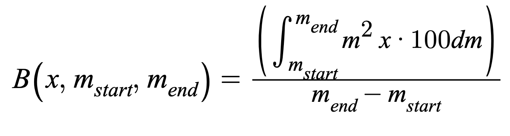
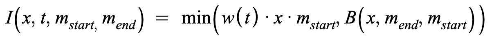

# UniswapIncentive

## Contract

[UniswapIncentive.sol](https://github.com/fei-protocol/fei-protocol-core/blob/master/contracts/token/UniswapIncentive.sol) implements [IUniswapIncentive](https://github.com/fei-protocol/fei-protocol-core/blob/master/contracts/token/IUniswapIncentive.sol), [UniRef](https://github.com/fei-protocol/fei-protocol-core/blob/master/contracts/refs/UniRef.sol)

## Description

The FEI incentive contract applied on transfers involving a Uniswap pair.

The UniswapIncentive contract assumes that all transfers involving Uniswap are either a sell or a buy. In either case, the hypothetical start and end price are calculated then compared to the peg to capture the magnitude distance _m_. See UniRef for more details on how these formulas are derived.



These parameters are fed into the incentive function to produce a mint \(in the case of buy\) or burn \(in the case of sell\) action. Any address can be exempted from incentives by governance.


The below incentives only apply to the FEI portion of the trade that would be below the peg. When calculating "x", the contract uses the "distance from peg FEI" method in [UniRef](../references/uniref.md).


### Sell \(Burn\)

All FEI transfers going TO the uniswap pool are treated as a sell. This has the counterintuitive effect of treating liquidity provision as a sell.

The implementation integrates the burn function from the [white paper](../../whitepaper.md) with respect to the distance from the peg. This creates a nice path independent property where a trader is no better off doing one large trade or many small trades, ignoring fees. The burn formula for sell amount _x_ is: 



The burn is only applied to trades below the peg when the incentive contract is appointed as a Burner🔥.

The burn is taken from the in-flight trade amount. If the burn is 5% on a 100 FEI transfer then the recipient gets 95 FEI. 


The entire trade size including the burn is used to calculate the slippage for the end deviation from the peg. This could lead to a higher than expected burn for large trades when below peg.



The trade will revert if the burn would be greater than or equal to the entire transfer amount


### Buy \(Mint\)

All transfers going FROM the uniswap pool are treated as a buy. This has the counterintuitive effect of treating liquidity withdrawal events as buys.

The initial magnitude _m_ deviation from the peg before the hypothetical trade is used to maximize the potential mint amount. _w_ is the time weight we discuss in the next section. The mint formula for buy amount _x_ is: 



The incentive formula is normally just the right-hand side of the above min function. It is linear in the time weight `w(t)` and the distance from the peg `m`

When the incentive function for a trade reaches the same level as the burn for the same trade _in reverse_, the incentive function maxes out. This is because we don't want a trader to be able to profit by buying and selling with a flash loan under any circumstances.

The mint should only apply if the trade starts below the peg and if the incentive contract is appointed as a Minter.

### Incentivized Amount

The incentivized

### Time Weight

The time weight _w_ is a scaling factor utilized to make the incentive mint structured like an auction. The trader willing to accept the lowest mint will execute a buy before the reward gets higher.

The time weight grows linearly at a rate of 75/100,000 per block, which equals 1 after approximately 5 hours. It should only grow while "active" and will only be active when the last trade ended below the peg. The rate can be changed by governance. 

Trades should update the time weight as follows:

* If ending above peg, set to 0 and deactivate
* If ending below the peg but starting above, set to 0 and activate
* If starting and ending below peg, update pro-rata with a buy based on percent towards peg. E.g., if a trade starts at 10% deviation and ends at 1%, time weight should be scaled by 1%/10% =.10.
* If starting and ending below the peg, cap the time weight at the max incentive for the ending distance

### Incentive Parity

Incentive parity is defined as a boolean expression, which is true when the mint incentive equals its max for the current distance from the peg `m`. It simplifies down to the following:


Parity is used as a trigger condition for reweights in the [UniswapPCVController](https://github.com/fei-protocol/fei-protocol-core/wiki/UniswapPCVController)

## [Access Control](../access-control/) 

* Minter💰
* Burner🔥

## Events



Time Weight change

| type | param | description |
| :--- | :--- | :--- |
| uint256 | \_weight | new time weight |
| uint256 | \_active | whether time weight is growing or not |



Governance change of time weight growth weight

| type | param | description |
| :--- | :--- | :--- |
| uint256 | \_growthRate | new growth rate |



Governance change of an exempt address 

| type | param | description |
| :--- | :--- | :--- |
| address indexed | \_account | the address to update |
| bool | \_isExempt | whether the account is exempt or not |



Governance change of a sell allowlisted address 

| type | param | description |
| :--- | :--- | :--- |
| address indexed | \_account | the address to update |
| bool | \_isSellAllowed | whether the account is allowlisted or not |



## Read-Only Functions

### isIncentiveParity

```javascript
function isIncentiveParity() external view returns (bool);
```

returns true if the conditions for incentive parity \(see above\) are met, otherwise false.

### isExemptAddress

```javascript
function isExemptAddress(address account) external view returns (bool);
```

returns true if `account` is exempted from incentives, otherwise false

### TIME\_WEIGHT\_GRANULARITY

```javascript
function TIME_WEIGHT_GRANULARITY() external view returns (uint32);
```

returns the granularity of the time weight variable, set as a constant to `100,000`

### getGrowthRate

```javascript
function getGrowthRate() external view returns (uint32);
```

returns the current time weight growth rate, per block

### getTimeWeight

```javascript
function getTimeWeight() external view returns (uint32);
```

returns the current time weight

### isTimeWeightActive

```javascript
function isTimeWeightActive() external view returns (bool);
```

returns true if the time weight is active and growing

### getBuyIncentive

```javascript
function getBuyIncentive(uint256 amount)
    external
    view
    returns (
        uint256 incentive,
        uint32 weight,
        Decimal.D256 memory initialDeviation,
        Decimal.D256 memory finalDeviation
    );
```

returns the buy incentive amount `incentive`for a FEI transfer of `amount`out of the FEI/ETH incentivized Uniswap pool. Also returns the updated time weight `weight` and the `initialDeviation` and `finalDeviation` which are equal to _m_ start and end, respectively.

### getSellPenalty

```javascript
function getSellPenalty(uint256 amount)
    external
    view
    returns (
        uint256 penalty,
        Decimal.D256 memory initialDeviation,
        Decimal.D256 memory finalDeviation
    );
```

returns the sell penalty amount `penalty` a FEI transfer of `amount` into the FEI/ETH incentivized Uniswap pool. Also returns the `initialDeviation` and `finalDeviation` which are equal to _m_ start and end, respectively.

## State-Changing Functions <a id="state-changing-functions"></a>

### Governor-Only⚖️

#### setExemptAddress

```javascript
function setExemptAddress(address account, bool isExempt) external;
```

set `account` incentive exempt status to `isExempt`

emits `ExemptAddressUpdate`

#### setTimeWeight

```javascript
function setTimeWeight(
    uint32 weight,
    uint32 growth,
    bool active
) external;
```

set the current time weight to `weight`, growing at a rate `growth` and active flag to `active` starting from the current block.

emits `TimeWeightUpdate` and `GrowthRateUpdate` if the growth rate changes

### Fei-Only🌲

#### incentivize

```javascript
function incentivize(
    address sender,
    address receiver,
    address operator,
    uint256 amountIn
) external
```

updates the oracle at the beginning of the flow

applies the buy reward based on `amountIn` if:

* below peg
* time weight non-zero
* contract is a Minter💰
* `sender` is the ETH/FEI incentivized pair
* `receiver` is not exempt

applies the sell penalty based on `amountIn` if:

* trade ends below peg
* contract is a Burner🔥
* `receiver` is the ETH/FEI incentivized pair
* `sender` is not exempt


