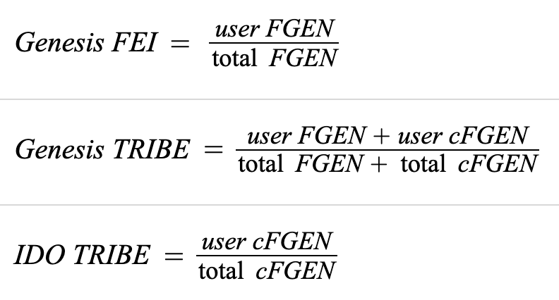

# GenesisGroup

## Contract

[GenesisGroup.sol](https://github.com/fei-protocol/fei-protocol-core/blob/master/contracts/genesis/GenesisGroup.sol) implements [IGenesisGroup](https://github.com/fei-protocol/fei-protocol-core/blob/master/contracts/genesis/IGenesisGroup.sol), [CoreRef](https://github.com/fei-protocol/fei-protocol-core/blob/master/contracts/refs/CoreRef.sol), [ERC20](https://docs.openzeppelin.com/contracts/3.x/api/token/erc20#ERC20), [Timed](https://github.com/fei-protocol/fei-protocol-core/blob/master/contracts/utils/Timed.sol)

## Description

The Genesis Group Contract is responsible for launching Fei Protocol. It allows for pro-rata access to the first bonding curve transaction and includes a TRIBE distribution.

### FGEN

The user's Genesis balances are managed by an FGEN ERC-20 token. FGEN are a tokenized version of the committed ETH. FGEN tokens are fungible and can be transferred and even sold if secondary markets arise.

FGEN are used to account for the user's final outcome in Genesis.

### Outcome determination


FGEN maps to "committed ETH" and converted-FGEN maps to "pre-swapping" TRIBE.


At redemption time, users could have a combination of FGEN and converted-FGEN \(cFGEN\) tokens. cFGEN are not ERC-20 tokens and are only utilized during Genesis. The ratios of FGEN and cFGEN to the totals determine how much FEI and TRIBE each user receives. The TRIBE can be further split into "Genesis TRIBE" which are the additional allocation to the Genesis Group and "IDO TRIBE" which come from exchanging pre-converted FEI in the IDO.

Genesis allocation formulas:



Both the held FGEN and pre-converted balance are used to determine ownership of the Genesis TRIBE. Only the held FGEN is used for determining FEI ownership because the pre-converted FGEN FEI allocation is used to swap for TRIBE. Of the IDO TRIBE allocation, users get the pro-rata percentage of their pre-converted FGEN over all of the pre-converted FGEN.

## Events



A purchase into the Genesis Group

| type | param | description |
| :--- | :--- | :--- |
| address indexed | \_to | the address to send Fei Genesis share tokens \(FGEN\) to |
| uint256 | \_value | the amount of ETH deposited |



Pre-commit Genesis share tokens \(FGEN\) to buy TRIBE in IDO

| type | param | description |
| :--- | :--- | :--- |
| address indexed | \_from | account with the FGEN to commit |
| address indexed | \_to | account to receive and redeem the rewards post-genesis |
| uint256 | \_amount | amount of FGEN committed |



Redeem Fei Genesis share tokens \(FGEN\) for FEI and TRIBE

| type | param | description |
| :--- | :--- | :--- |
| address indexed | \_to | the address to send TRIBE and FEI to |
| uint256 | \_amountIn | amount of FGEN redeemed |
| uint256 | \_amountFei | amount of FEI received |
| uint256 | \_amountTribe | amount of TRIBE received |



The completion of the Genesis Group and launch of Fei Protocol. Only emitted once

| type | param | description |
| :--- | :--- | :--- |
| uint256 | \_timestamp | the block timestamp of deployment |



## Read-Only Functions

### getAmountOut

```javascript
function getAmountOut(uint256 amountIn, bool inclusive)
    external
    view
    returns (uint256 feiAmount, uint256 tribeAmount);
```

Returns the hypothetical `feiAmount` of FEI and `tribeAmount`of TRIBE that the user would receive if they have `amountIn` FGEN and genesis were to launch immediately. 

The `inclusive` flag would signify that the `amounIn` is already a part of the existing FGEN total supply, otherwise it is added on to simulate a purchase.

### getAmountsToRedeem

```javascript
function getAmountsToRedeem(address to)
    external
    view
    returns (
        uint256 feiAmount,
        uint256 genesisTribe,
        uint256 idoTribe
    )
```

For an address `to`, returns how much FEI is available for redemption `feiAmount`, how much TRIBE is available from the Genesis bonus `genesisTribe`, and how much TRIBE is available from the IDO pre-commitment `idoTribe`, if any.


Reverts if called pre-launch, as there is no way to know the redeemable amount for a user


## State-Changing Functions <a id="state-changing-functions"></a>

### Public

#### purchase

```javascript
function purchase(address to, uint256 value) external payable;
```

Purchase awards the user with an ERC-20 token 1:1 for their ETH called FGEN. This amount equals to `value`.  Only available during the Genesis Period.

emits `Purchase`


purchase\(\) maps to an "ETH commitment" which outputs FGEN.


#### commit

```javascript
function commit(
    address from,
    address to,
    uint256 amount
) external;
```

Pre-commit `amount` of FGEN to have the associated Genesis FEI participate in the initial DEX offering of TRIBE on Uniswap. Burn FGEN from the `from` address and grant the pre-commitment rewards to the `to` address. This can only be done during the Genesis Period.

emits `Commit`


`commit`\(\) maps to a "TRIBE pre-swap"



When a user pre-converts, their FGEN is burned. This makes it a one-way action. 


#### redeem

```javascript
function redeem(address to) external;
```

Redeem FGEN and cFGEN from `to` for a pro rata share of the FEI purchased on the bonding curve and the Genesis TRIBE allocation. Any contract can redeem on behalf of a user if they have FGEN approval. Redemptions must be for the entire held balance of FGEN and cFGEN.

emits `Redeem`

#### emergencyExit

```javascript
function emergencyExit(address from, address payable to) external;
```

Redeem all FGEN and cFGEN held by the address `from` for ETH 1:1, sending the ETH to address `to`. This is intended only for the scenario where the launch functionality is bricked as a way for users to get their ETH back.

Only available 3 days AFTER the Genesis Period ends, if launch has not been called.

### EOA-Only 👤

#### launch

```javascript
function launch() external;
```

Launching is only open at the end of the Genesis Period. The following actions happen at launch:

* Mark Genesis Group as completed in Core \(for other contracts to reference\)
* Initializing the BondingCurveOracle price for thawing
* Making the first bonding curve purchase of FEI with all held ETH. \(needs to happen after oracle init so the FEI is deployed at right ratio on Uniswap\)
* Allocate bonding curve ETH to the PCV deposit
* Initialize the FEI/TRIBE staking pool
* Deploy the IDO FEI/TRIBE funds to Uniswap.
* Execute the swap of FEI for pre-swappingTRIBE on the IDO

emits `Launch`

