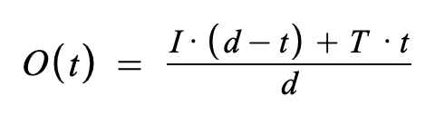

# BondingCurveOracle

## Contract

[BondingCurveOracle.sol](https://github.com/fei-protocol/fei-protocol-core/blob/master/contracts/oracle/BondingCurveOracle.sol) implements [IBondingCurveOracle](https://github.com/fei-protocol/fei-protocol-core/blob/master/contracts/oracle/IBondingCurveOracle.sol), [CoreRef](https://github.com/fei-protocol/fei-protocol-core/blob/master/contracts/refs/CoreRef.sol), [Timed](https://github.com/fei-protocol/fei-protocol-core/blob/master/contracts/utils/Timed.sol)

## Description

The BondingCurveOracle contract pegs to a linked bonding curve price pre Scale and to a normal UniswapOracle post Scale.

The contract stores the bonding curve \(pre-Scale\) and Uniswap \(post-scale\) oracle contracts to reference.

Updates to the bonding curve oracle update the linked uniswap oracle.

### Thawing

Includes "thawing". Thawing means that the initial pegged price is lower than the target uniswap/bonding curve price. The reported peg linearly converges on the target peg over a preset duration. The duration _d_ is 2 weeks. At the beginning of the window it should fully report the peg at the initial price _I_ and at the end it should fully report the peg at the target price _T_. Let _t_ be the timestamp between \[0,d\]. The reported oracle price _O_ during the thawing period is:



## Events



 new reported peg

| type | param | description |
| :--- | :--- | :--- |
| uint256 | \_peg | new peg value |



Oracle kill switch change

| type | param | description |
| :--- | :--- | :--- |
| bool | \_killSwitch | new value of the kill switch flag |



## Read-Only Functions

### read

```javascript
function read() external view returns (Decimal.D256 memory, bool);
```

Reads the oracle value and reports the peg as FEI per underlying. The boolean returned signifies whether the reported value is valid. Invalid generally means the oracle is uninitialized or the kill switch is engaged.

#### isOutdated

```javascript
function isOutdated() external view returns (bool);
```

Pass through calls `uniswapOracle.isOutdated()` if false, then many read functions relying on the oracle would be inaccurate.

#### killSwitch

```javascript
function killSwitch() external view returns (bool);
```

The kill switch value, if true then the read function returns invalid.

#### uniswapOracle

```javascript
function uniswapOracle() external returns (IOracle);
```

The referenced [Uniswap Oracle](uniswaporacle.md)

#### bondingCurve

```javascript
function bondingCurve() external returns (IBondingCurve);
```

The referenced [Bonding Curve](../bondingcurve/)

#### initialPrice

```javascript
function initialPrice() external returns (Decimal.D256 memory);
```

The initial price to thaw from during the thawing period reported as USD per FEI.

## State-Changing Functions <a id="state-changing-functions"></a>

### Public

#### update

```javascript
function update() external returns (bool);
```

Pass-through updates `uniswapOracle`

### Governor- Or Guardian-Only⚖️🛡

#### setKillSwitch

```javascript
function setKillSwitch(bool _killSwitch) external;
```

Enables or disables the oracle depending on the `_killSwitch` flag passed in.

emits `KillSwitchUpdate`

### GenesisGroup-Only🚀

#### init

```javascript
function init(Decimal.D256 calldata initialPrice) external;
```

called by the [GenesisGroup](../genesis/genesisgroup.md) with the initial price to thaw from

