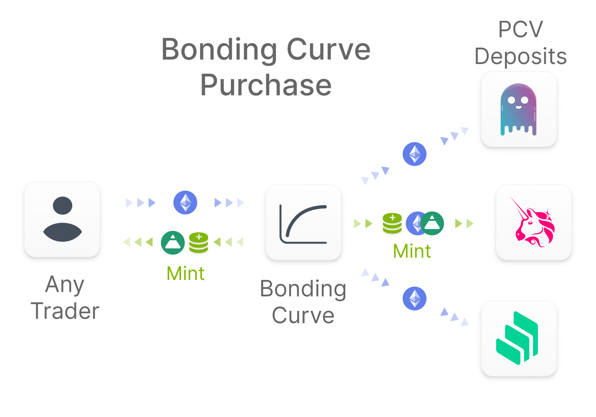

# Protocol Controlled Value

Protocol Controlled Value ****\(PCV\) is a categorization of Total Value Locked \(TVL\) that represents all assets that are not ultimately redeemable by users. Some commonly used examples of PCV are DAO treasuries and insurance funds. PCV can be extended conceptually to include any algorithmic management of protocol owned assets to facilitate protocol goals such as liquidity and stability.

## PCV Funding

In general there are two ways for a protocol to fund PCV:

1. Fees for functionality
2. Issuing a token

Examples of the former include Compound and Aave insurance pools funded by a spread on borrowing interest rates.

For the latter, examples include NXM token issuance, or just about any governance token in which the protocol holds some as a DAO treasury.

The primary way Fei Protocol funds PCV is bonding curve FEI issuance. The bonding curve offers FEI in exchange for PCV such as ETH at an exchange rate determined by an oracle. It escrows this PCV until a keeper allocates it to various _PCV Deposit_ contracts.



## Generalized PCV

Fei Protocol is designed to support generalized Protocol Controlled Value. The protocol can fundraise PCV in any ERC-20 token by issuing a bonding curve denominated in that asset, as long as there is a reliable oracle to handle pricing.

_PCV Controllers_ are responsible for managing PCV among the various PCV Deposits. Future Fei Protocol upgrades can algorithmically adjust PCV based on market conditions or include unique two-way integrations with other protocols. These integrations can leveraging the utility tokens of other platforms or their functionality with other ERC-20s held by the protocol.

