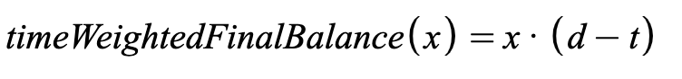

# Staking

Fei Protocol has a staking pool in which FEI/TRIBE Uniswap LP tokens are deposited and TRIBE is earned over time. The total reward balance is 10% of the initial TRIBE supply distributed over 2 years. The rewards decrease linearly so they are front loaded. Our novel pool contract has the benefit of being completely fluid with no epochs. Traders can deposit, withdraw, and claim whenever they want. This does come with a side effect of dilution on unclaimed balances.


To improve returns in the staking pool we recommend claiming weekly


## Pool Math

The Pool contract uses a concept called "time-weighted final balance" to keep track of the token-seconds a user has deposited into the pool. To calculate the time-weighted final balance, simply take the number of seconds until the end of the pool window and multiply them by the number of tokens staked. Let _d_ be the duration of the window and _t_ be the number of seconds into the window:

When a user deposits tokens into the pool, they receive the time weighted final balance equivalent of their tokens in "FPOOL" tokens.

To calculate how many of the FPOOL tokens are redeemable at any given time, simply subtract the _current_ time weighted final balance from the total amount of FPOOL held by a user. The remainder is the number of token-seconds that the user has staked in the pool up until now.

The rewards are released into the pool according to an arbitrary reward function. The [FeiPool](feipool.md) contract uses a linearly decreasing reward schedule.

The amount of tokens redeemable by a user at any given time is the proportion of redeemable FPOOL tokens to the total redeemable multiplied by the number of released, unclaimed rewards.

When a user withdraws, they claim all rewards and have their initial stake returned.

The Fei Pool contracts have the following properties: 

1.  All rewards take into account time and volume in the pool proportionally when determining ownership of released rewards 
2. Assuming rewards are claimed continuously, this model achieves the desired property of fluidity and time weighted ownership 
3. Any new supply "dilutes" ownership in unclaimed rewards over time but not immediately
4. Transfers of FPOOL should update the staked balances of the holders pro-rata

