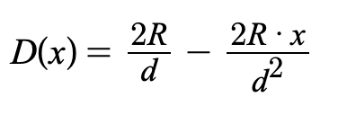

# FeiRewardsDistributor

## Contract

[FeiRewardsDistributor.sol](https://github.com/fei-protocol/fei-protocol-core/blob/master/contracts/staking/FeiRewardsDistributor.sol) implements [IRewardsDistributor](https://github.com/fei-protocol/fei-protocol-core/blob/master/contracts/staking/IRewardsDistributor.sol), [CoreRef](https://github.com/fei-protocol/fei-protocol-core/blob/master/contracts/refs/CoreRef.sol), [Timed](https://github.com/fei-protocol/fei-protocol-core/blob/master/contracts/utils/Timed.sol)

## Description

The FeiRewardsDistributor contract is responsible for sending rewards to the FeiStakingRewards contract each week. 

It has one public method exposed for keepers to execute this drip functionality, which rewards the caller with a fixed amount of [FEI](../fei-stablecoin/).



### Release Schedule

The release schedule for the total reward amount _R_ of TRIBE is a linearly decreasing TRIBE distribution. The distribution function is:



This function has a duration of _d_ before it hits a 0 distribution rate. The area under the curve is _R,_ because the y-intercept is 2R/d, by simply multiplying base times height times 1/2.

Set the "unreleased function" _U\(t\)_ equal to the area under this curve between the current elapsed time _t_  and the total duration _d._ Note that for t=d the output is equal to 0 as all of the TRIBE should be released. The formula is:


## Events



 Sent TRIBE to the FeiStakingRewards contract

| type | param | description |
| :--- | :--- | :--- |
| address indexed | \_caller | account that triggered the drip |
| uint256 | \_amount | amount of TRIBE dripped |



A withdrawal of TRIBE from the distributor

| type | param | description |
| :--- | :--- | :--- |
| uint256 | \_amount | amount withdrawn |



Change the drip frequency

| type | param | description |
| :--- | :--- | :--- |
| uint256 | \_amountReward | new drip frequency |



Change in the FEI reward for dripping

| type | param | description |
| :--- | :--- | :--- |
| uint256 | \_incentiveAmount | new incentive amount |



Updates the pause kill switch

| type | param | description |
| :--- | :--- | :--- |
| bool | \_killSwitch | the new kill switch value |



A change in the staking contract to send TRIBE to.

| type | param | description |
| :--- | :--- | :--- |
| bool | \_killSwitch | the new kill switch value |



## Read-Only Functions

### incentiveAmount

```javascript
function incentiveAmount() external view returns (uint256);
```

Returns the amount of FEI sent to the caller of `drip()`.

### dripFrequency

```javascript
function dripFrequency() external view returns (uint256);
```

The minimum frequency allowed between rewards distribution.

### nextDripAvailable

```javascript
function nextDripAvailable() external view returns (uint256);
```

The next block timestamp when reward distribution is allowed by the contract. Equals `lastDistributionTime() + dripFrequency()`

### lastDistributionTime

```javascript
function lastDistributionTime() external view returns (uint256);
```

The last block timestamp when rewards were distributed from the contract.

### stakingContract

```javascript
function stakingContract() external view returns (IStakingRewards);
```

The [FeiStakingRewards](feistakingrewards.md) contract address

### totalReward

```javascript
function totalReward() external view returns (uint256);
```

Returns the total amount of rewards released over the entire window, including claimed, released, and unreleased.

### releasedReward

```javascript
function releasedReward() external view returns (uint256);
```

Returns the amount of `rewardToken` available for claiming by the pool. Calculated as `rewardBalance() - unreleasedReward()`.

### unreleasedReward

```javascript
function unreleasedReward() external view returns (uint256);
```

The unreleased reward function following the formula shown in the Release Schedule section above. It starts at the `totalReward()` amount and then wind down to 0 over the `duration` of the window.

### rewardBalance

```javascript
function rewardBalance() external view returns (uint256);
```

The amount of [TRIBE](../../governance/tribe.md) held by the contract, released or unreleased.

### distributedRewards

```javascript
function distributedRewards() external view returns (uint256);
```

The total amount of [TRIBE](../../governance/tribe.md) already distributed to [FeiStakingRewards](feistakingrewards.md).

### killSwitch

```javascript
function killSwitch() external view returns (bool);
```

Returns whether the contract is paused or not. If the switch is true, `drip()` will revert

## State-Changing Functions <a id="state-changing-functions"></a>

### Public

#### drip

```javascript
function drip() external returns (uint256);
```

Send `releasedReward()` [TRIBE](../../governance/tribe.md) to the `stakingRewards()` contract and updates the reward rate.

Incentivizes the caller with `incentiveAmount()` [FEI](../fei-stablecoin/fei-fei-usd.md).


Only callable when `nextDripAvailable()` is below the current block timestamp and the contract is not paused


### Governor-Only⚖️

#### governorWithdrawTribe

```javascript
function governorWithdraw(uint256 amount) external;
```

Withdraw `amount` TRIBE tokens from the pool to [Fei Core.](../access-control/core.md)

#### governorRecover

```javascript
function governorRecover(address tokenAddress, address to, uint256 amount) external;
```

Recover `tokenAddress` ERC20 tokens from the FeiStakingRewards contract to address `to`. This is used if there were AMM rewards distributed.

#### setDripFrequency

```javascript
function setDripFrequency(uint256 _frequency) external;
```

Sets the frequency with which the contract calls the FeiStakingRewards.

#### setIncentiveAmount

```javascript
function setIncentiveAmount(uint256 _incentiveAmount) external;
```

Sets the incentive amount for calling `drip()`.

#### setStakingContract

```javascript
function setStakingContract(address _stakingRewards) external;
```

Sets the staking contract to send TRIBE to.

### Guardian- Or Governor-Only🛡⚖️

#### setKillSwitch

```javascript
function setKillSwitch(bool _killSwitch) external;
```

Pauses the contract's ability to `drip()` when set to true,

